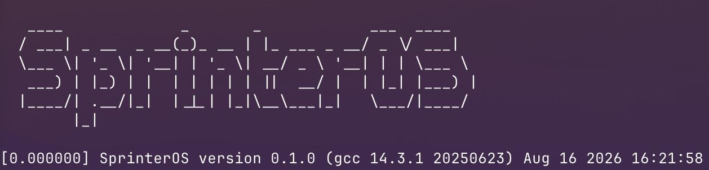

# SprinterOS
A lightweight Real-Time OS and Bootloader for Cortex-M7, completely bare-metal

</img>
##### SprinterOS Project Wiki: https://stevenmu.dev/wiki <br>
##### Trello Board: https://trello.com/b/7di7a92U/sprinteros-development <br>

## What this project is
The goal is to bring up a CORTEX-M7 based STM32F767ZI chip, with no help from HAL or any external libraries, purely by reading reference manuals & datasheets. At the end:
- bootloader
- true real-time kernel
- user facing CLI that resembles linux

## Performance & Resource Usage
With all the features, we're stuck with only 2MB of FLASH, around half we need for user. Also, we only have 512KB of memory.
As a result, the OS is written with extreme care for the size and resource constraints

#### Bootloader
| Region | Used      | Size   | Usage |
| :----- | --------: | -----: | ----: |
| RAM    | 2,000 B   | 512 KB | 0.38% |
| FLASH  | 10,904 B  | 2 MB   | 0.52% |

## Try It Yourself

1. Connect a SPI based SD card reader onto a SPI. make sure to edit the main bootloader to reflect this if you do! 
```
// change SPIx to the right SPI you are using
if (init_spi(&spi_master, SPI1)) {
```

2. Build and load the bootloader. For STM platforms, the recommended approach is via the `st-flash` utility

```
cd boot

make clean
make boot

// ensure that your device is connected
st-flash write build/boot.bin 0x08000000
```

3. Build and load the kernel
```
cd kernel

make clean
make sprinter

// ensure that the SD card is connected your computer, and use the sprinterloader utility
cd ..
cd tools
./sprinterloader.sh <kernel_img_location> <disk>
```

4. Connect to UART (UART_1 is currently supported), you should see UART logs from boot and kernel upon boot!

## Supported Hardware
- ARM CORTEX-M7 Based Hardware (STM32F767ZI used as dev chip)

## Contact
- For any inquiries, please reach out to xsmu0922@gmail.com
